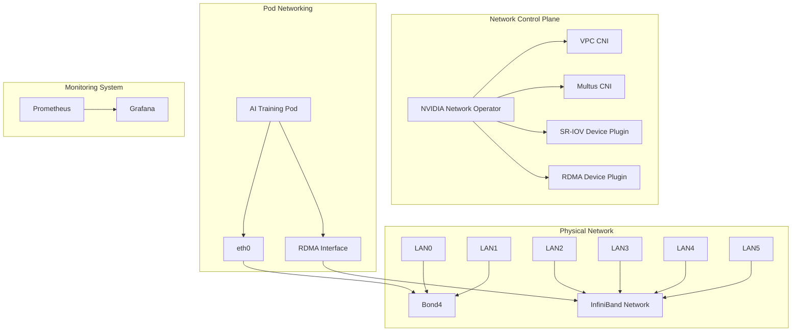

# K8s AI Infrastructure

<div align="center">


[English](README.md) | [中文文档](README_CN.md)

</div>

High-performance AI training infrastructure deployment solution for Kubernetes clusters, optimized for NVIDIA A100/A800 GPU clusters with InfiniBand networking.

## ✨ Features

- 🚀 **High Performance**: Optimized for NVIDIA A100/A800 GPU clusters
- 🌐 **Advanced Networking**: InfiniBand support with RDMA
- 📊 **Comprehensive Monitoring**: GPU and network metrics tracking
- 🔄 **Automated Deployment**: Streamlined setup process
- 🛡️ **Production Ready**: Enterprise-grade security and stability

## 🏗️ System Architecture



## 🚀 Quick Start

### Prerequisites

- Kubernetes 1.20+
- NVIDIA A100/A800 GPUs
- Mellanox InfiniBand NICs
- Helm 3.0+

### Installation

1. Configure network environment:
```bash
./scripts/setup-network.sh
```

2. Deploy NVIDIA Network Operator:
```bash
./scripts/deploy-network-operator.sh
```

3. Verify deployment:
```bash
./scripts/test-network.sh
```

## 📚 Documentation

- [Network Architecture](docs/network-architecture.md)
- [Ray Cluster Setup](docs/ray-cluster.md)
- [Monitoring Guide](docs/monitoring.md)
- [Performance Tuning](docs/performance-tuning.md)

## 🛠️ Components

### Network Infrastructure
- Bond4 configuration for management traffic
- InfiniBand network for high-speed data transfer
- RDMA support for direct memory access
- SR-IOV for network virtualization

### Monitoring Stack
- Prometheus for metrics collection
- Grafana for visualization
- Custom exporters for GPU and network metrics
- Comprehensive alerting rules

### Ray Integration
- Distributed training support
- GPU-aware scheduling
- NCCL optimization
- Topology-aware placement

## 📊 Performance

- NVLink: Up to 600 GB/s bidirectional bandwidth
- InfiniBand: Up to 200 Gb/s network speed
- RDMA: Ultra-low latency communication
- GPUDirect: Optimized GPU-to-GPU transfer

## 🤝 Contributing

Contributions are welcome! Please read our [Contributing Guidelines](CONTRIBUTING.md) for details.

## 📝 License

This project is licensed under the Apache License 2.0 - see the [LICENSE](LICENSE) file for details. 