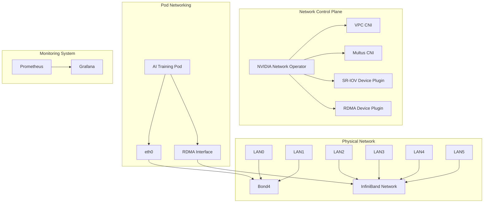
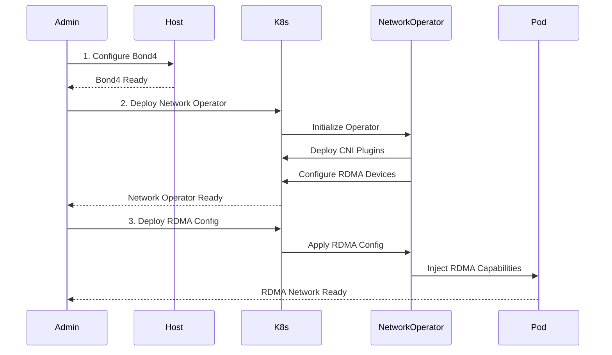

# K8s AI Infrastructure

This project provides comprehensive configurations and scripts for deploying AI training infrastructure on Kubernetes clusters, specifically optimized for NVIDIA A100/A800 GPU clusters with high-performance networking.

## System Architecture



## Deployment Flow



## Directory Structure

```
k8s-ai-infra/
├── network/        # Network-related configurations
│   ├── bond4-config.sh            # Bond4 network setup
│   ├── network-operator-values.yaml # Operator configuration
│   └── network-policy.yaml        # Network policies
├── rdma/           # RDMA device configurations
│   ├── rdma-config.yaml          # RDMA settings
│   └── rdma-test-pod.yaml        # Test pod
├── monitoring/     # Monitoring configurations
│   └── network-monitor.yaml      # Monitoring setup
└── scripts/        # Deployment scripts
    ├── deploy-network-operator.sh # Deployment script
    └── test-network.sh           # Testing script
```

## Quick Start

### 1. Prerequisites
- Ensure the following requirements are met:
  - Kubernetes 1.20+
  - NVIDIA GPU A100/A800
  - Mellanox InfiniBand NICs
  - Helm 3.0+

### 2. Network Configuration
```bash
# Configure network environment
./scripts/setup-network.sh
```

### 3. Deploy Network Operator
```bash
# Deploy NVIDIA Network Operator
./scripts/deploy-network-operator.sh
```

### 4. Verify Deployment
```bash
# Test network configuration
./scripts/test-network.sh
```

## Network Architecture Details

### Management Plane (North-South Traffic)
- Uses Bond4 (lan0 + lan1)
- Mode: LACP (mode 4)
- Primary uses:
  - K8s control plane communication
  - Pod basic networking (eth0)
  - Cluster management and monitoring

### Data Plane (East-West Traffic)
- Uses InfiniBand network (lan2-lan5)
- Configuration:
  - SR-IOV virtualization
  - RDMA passthrough
  - PFC flow control
- Primary uses:
  - GPU-to-GPU communication
  - Distributed training data transfer
  - High-performance storage access

### CNI Configuration
- Primary Network: VPC CNI
  - Handles basic pod networking
  - Provides cluster network policy support
- Additional Network: Multus CNI
  - Manages RDMA/IB interfaces
  - Supports SR-IOV device allocation

## Ray Cluster Communication Architecture

```mermaid
graph TB
    subgraph "Node 1"
        subgraph "GPU Group 1"
            G1[GPU 0]
            G2[GPU 1]
            G3[GPU 2]
            G4[GPU 3]
            G5[GPU 4]
            G6[GPU 5]
            G7[GPU 6]
            G8[GPU 7]
        end
        
        IB1[IB HCA]
        
        %% NVLink connections within Node 1
        G1 <--> G2
        G2 <--> G3
        G3 <--> G4
        G4 <--> G1
        G5 <--> G6
        G6 <--> G7
        G7 <--> G8
        G8 <--> G5
        
        %% GPU to IB connections
        G1 --> IB1
        G5 --> IB1
    end

    subgraph "Node 2"
        subgraph "GPU Group 2"
            G9[GPU 0]
            G10[GPU 1]
            G11[GPU 2]
            G12[GPU 3]
            G13[GPU 4]
            G14[GPU 5]
            G15[GPU 6]
            G16[GPU 7]
        end
        
        IB2[IB HCA]
        
        %% NVLink connections within Node 2
        G9 <--> G10
        G10 <--> G11
        G11 <--> G12
        G12 <--> G9
        G13 <--> G14
        G14 <--> G15
        G15 <--> G16
        G16 <--> G13
        
        %% GPU to IB connections
        G9 --> IB2
        G13 --> IB2
    end

    %% InfiniBand network connection between nodes
    IB1 <--> IB2

    style G1 fill:#f9f,stroke:#333,stroke-width:2px
    style G2 fill:#f9f,stroke:#333,stroke-width:2px
    style G3 fill:#f9f,stroke:#333,stroke-width:2px
    style G4 fill:#f9f,stroke:#333,stroke-width:2px
    style G5 fill:#f9f,stroke:#333,stroke-width:2px
    style G6 fill:#f9f,stroke:#333,stroke-width:2px
    style G7 fill:#f9f,stroke:#333,stroke-width:2px
    style G8 fill:#f9f,stroke:#333,stroke-width:2px
    style G9 fill:#f9f,stroke:#333,stroke-width:2px
    style G10 fill:#f9f,stroke:#333,stroke-width:2px
    style G11 fill:#f9f,stroke:#333,stroke-width:2px
    style G12 fill:#f9f,stroke:#333,stroke-width:2px
    style G13 fill:#f9f,stroke:#333,stroke-width:2px
    style G14 fill:#f9f,stroke:#333,stroke-width:2px
    style G15 fill:#f9f,stroke:#333,stroke-width:2px
    style G16 fill:#f9f,stroke:#333,stroke-width:2px
    style IB1 fill:#9cf,stroke:#333,stroke-width:2px
    style IB2 fill:#9cf,stroke:#333,stroke-width:2px

%% Style definitions
classDef default fill:#f9f,stroke:#333,stroke-width:2px;
classDef ibhca fill:#9cf,stroke:#333,stroke-width:2px;

Communication Details:
1. Intra-Node Communication:
   - GPUs communicate directly via NVLink (purple lines)
   - NVLink provides up to 600 GB/s bidirectional bandwidth
   - Cubic topology ensures optimal GPU-to-GPU connectivity
   - CUDA-aware NCCL automatically utilizes NVLink paths

2. Inter-Node Communication:
   - Nodes communicate via InfiniBand HCAs (blue boxes)
   - IB network supports up to 200 Gb/s bandwidth
   - RDMA enables direct memory access between nodes
   - GPUDirect RDMA bypasses CPU for GPU-to-GPU transfer

3. Topology Considerations:
   - Each node contains 8 GPUs in a cubic NVLink topology
   - IB HCAs are connected to specific GPUs for optimal routing
   - NUMA awareness ensures efficient memory access
   - PCIe topology is optimized for GPU-HCA communication

Configuration Guidelines:
1. NCCL Settings:
   - Enable NVLink for intra-node communication
   - Configure IB transport for inter-node communication
   - Set appropriate NUMA affinity
   - Enable GPUDirect RDMA for optimal performance

2. Ray Configuration:
   - Use placement groups for topology-aware scheduling
   - Configure worker groups based on GPU topology
   - Enable CUDA-aware collective communication
   - Optimize batch sizes for available NVLink bandwidth

3. Performance Optimization:
   - Monitor NVLink and IB bandwidth utilization
   - Track GPU-GPU communication patterns
   - Optimize data transfer scheduling
   - Balance computation and communication

4. Hardware Requirements:
   - NVIDIA A100/A800 GPUs with NVLink support
   - Mellanox ConnectX-6 HCAs for IB connectivity
   - PCIe Gen4 infrastructure
   - Appropriate power and cooling capacity 