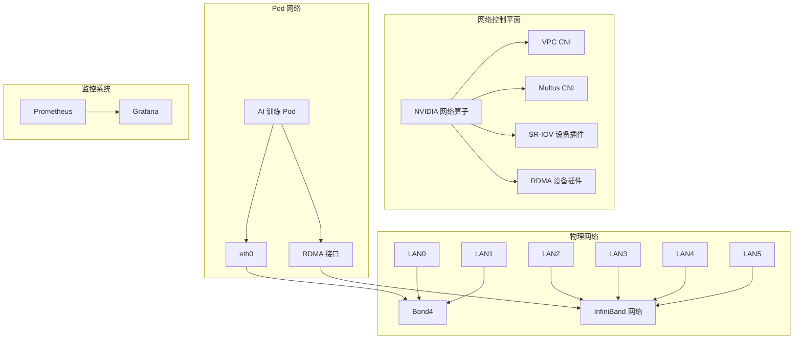

# Kubernetes AI 基础设施

<div align="center">


[English](README.md) | [中文文档](README_CN.md)

</div>

基于 Kubernetes 集群的高性能 AI 训练基础设施部署方案，专为配备 InfiniBand 网络的 NVIDIA A100/A800 GPU 集群优化设计。

## ✨ 特性

- 🚀 **高性能**：为 NVIDIA A100/A800 GPU 集群优化
- 🌐 **先进网络**：支持 RDMA 的 InfiniBand 网络
- 📊 **全面监控**：GPU 和网络指标跟踪
- 🔄 **自动部署**：流程化的安装过程
- 🛡️ **生产就绪**：企业级安全性和稳定性

## 🏗️ 系统架构



## 🚀 快速开始

### 前置条件

- Kubernetes 1.20+
- NVIDIA A100/A800 GPU
- Mellanox InfiniBand 网卡
- Helm 3.0+

### 安装步骤

1. 配置网络环境：
```bash
./scripts/setup-network.sh
```

2. 部署 NVIDIA 网络算子：
```bash
./scripts/deploy-network-operator.sh
```

3. 验证部署：
```bash
./scripts/test-network.sh
```

## 📚 文档

- [网络架构](docs/network-architecture.md)
- [Ray 集群配置](docs/ray-cluster.md)
- [监控指南](docs/monitoring.md)
- [性能调优](docs/performance-tuning.md)

## 🛠️ 组件

### 网络基础设施
- Bond4 管理流量配置
- 高速数据传输的 InfiniBand 网络
- 支持直接内存访问的 RDMA
- 网络虚拟化的 SR-IOV

### 监控系统
- Prometheus 指标采集
- Grafana 可视化展示
- GPU 和网络自定义导出器
- 完整的告警规则

### Ray 集成
- 分布式训练支持
- GPU 感知调度
- NCCL 优化
- 拓扑感知部署

## 📊 性能

- NVLink：高达 600 GB/s 双向带宽
- InfiniBand：高达 200 Gb/s 网络速度
- RDMA：超低延迟通信
- GPUDirect：优化的 GPU 间数据传输

## 🤝 贡献

欢迎贡献代码！请阅读我们的[贡献指南](CONTRIBUTING.md)了解详情。

## 📝 许可证

本项目采用 Apache License 2.0 许可证 - 查看 [LICENSE](LICENSE) 文件了解详情。 